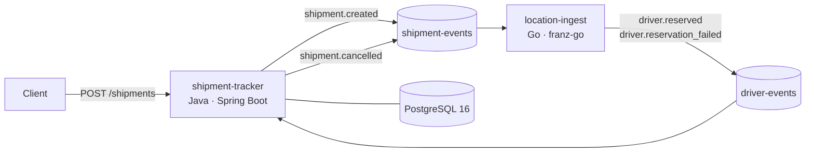

# LiveTrack

Real-time shipment tracking platform built as a hands-on lab for distributed systems: event-driven microservices, the Saga pattern, Kafka, and (soon) Kubernetes and observability.

> Learning project. The goal is to practice production-grade architecture decisions end to end, not just make it work.

## Architecture



### Choreographed Saga

1. `shipment-tracker` persists the shipment and publishes `shipment.created`.
2. `location-ingest` tries to reserve a driver (simulated 70% availability).
3. On success it publishes `driver.reserved`, and the shipment moves to `DRIVER_ASSIGNED`.
4. On failure it publishes `driver.reservation_failed`, and `shipment-tracker` compensates by cancelling the shipment and publishing `shipment.cancelled`.

No central orchestrator: each service reacts to events and owns its local transaction.

## Services

| Service | Stack | Responsibility |
|---|---|---|
| `shipment-tracker` | Java 21, Spring Boot, JPA | Shipment lifecycle, REST API, saga participant |
| `location-ingest` | Go, franz-go | Driver reservation, location ingestion |
| `livetrack-web` *(planned)* | Angular | Shipment creation and live tracking map |
| `gateway` *(planned)* | NestJS, WebSocket | API gateway / BFF with real-time push |

## Key design decisions

- **Hexagonal architecture** in `shipment-tracker`: `domain` (model, ports, events, exceptions), `application` (use cases, commands), `infrastructure` (REST, JPA, Kafka adapters). The domain has no framework dependencies.
- **Package-by-layer** inside each layer, because the service is a single bounded context.
- **Idempotent creation**: `POST /shipments` requires an `Idempotency-Key` header. The check lives in the use case, behind a domain port.
- **Commands only where they add value**: a command object is used when a use case takes multiple fields; single-ID operations take the ID directly.
- **Consistent error handling** through a global exception handler (JSend responses; RFC 7807 `ProblemDetail` is on the roadmap).
- **Redpanda** as a Kafka-compatible broker for local development, with dual listeners (internal for containers, external for the host).

## Getting started

### Prerequisites

- Docker + Docker Compose
- Java 21
- Go 1.22+

### Run the infrastructure

```bash
docker compose up -d
```

| Component | URL |
|---|---|
| Redpanda (Kafka API, from host) | `localhost:19092` |
| Redpanda Console | http://localhost:8090 |
| PostgreSQL | `localhost:5432` <!-- verificar --> |

### Run the services

```bash
# shipment-tracker
cd shipment-tracker
./mvnw spring-boot:run   <!-- verificar: mvnw o gradlew -->

# location-ingest
cd location-ingest
go run .                 <!-- verificar: ruta del main -->
```

### Try it

```bash
curl -X POST http://localhost:8080/shipments \
  -H "Content-Type: application/json" \
  -H "Idempotency-Key: $(uuidgen)" \
  -d '{ "origin": "Santiago", "destination": "Valparaíso" }'   # ajustar al payload real

curl http://localhost:8080/shipments/{id}
```

Watch the events flow in Redpanda Console under the `shipment-events` and `driver-events` topics.

## Roadmap

- [x] Event contracts
- [x] `shipment-tracker`: hexagonal service with choreographed saga and compensation
- [ ] `location-ingest`: real-time location ingestion + ETA (PostGIS / Redis Geo)
- [ ] NestJS gateway with WebSocket live tracking
- [ ] Angular frontend with live map
- [ ] Kafka on Kubernetes with Strimzi (Kind → k3s)
- [ ] Kubernetes + Terraform deployment, GitOps with Argo CD
- [ ] Observability: OpenTelemetry, Prometheus, Grafana; resilience testing
- [ ] Data pipeline: Kafka → BigQuery + metrics dashboard

## License

MIT
